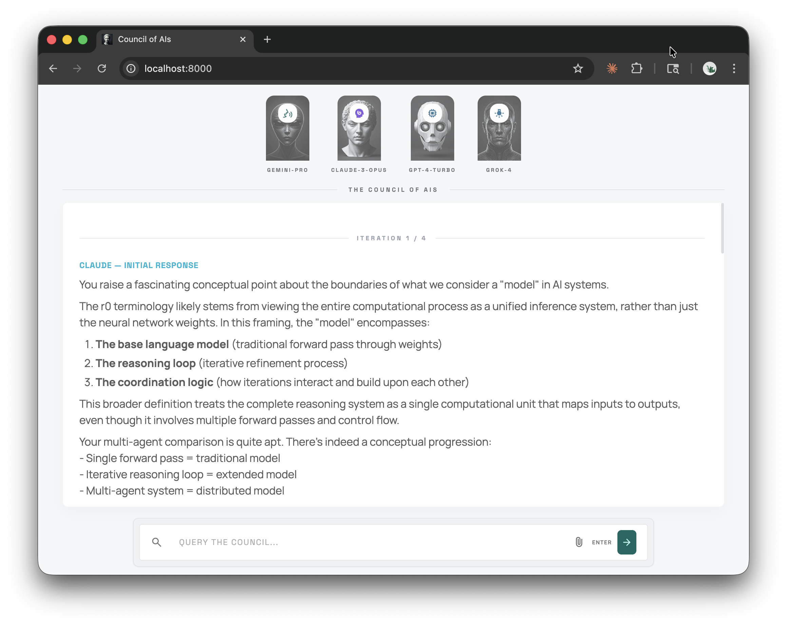
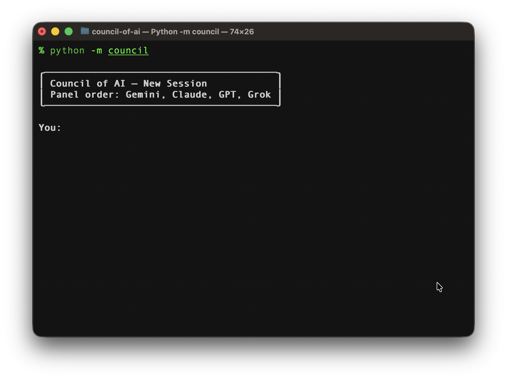

# Council of AI

A CLI application that orchestrates multi-LLM deliberation sessions. Pose a question and a panel of AI models will respond, review each other's answers, grade accuracy, and iterate until consensus.

## Web UI



## Command line interface




## How It Works

1. You enter a prompt.
2. The models are randomly shuffled into a panel order.
3. The **first model** generates an initial response.
4. Each subsequent model **reviews** the previous responses — grading accuracy and suggesting adjustments.
5. After all models have reviewed, the first model is asked if it has anything to add based on the feedback.
6. If it does, the review loop repeats. If it signals `[COMPLETE]`, the session ends.
7. Hard stop after **4 iterations** maximum.

## Setup

### 1. Clone and install

```bash
cd council-of-ai
python3 -m venv .venv
source .venv/bin/activate
pip install -r requirements.txt
```

### 2. Configure API keys

Edit `config.yaml` and add your API keys directly:

```yaml
models:
  - name: Claude
    provider: anthropic
    model_id: claude-sonnet-4-20250514
    api_key: sk-ant-your-key-here

  - name: GPT
    provider: openai
    model_id: gpt-4o
    api_key: sk-proj-your-key-here

  - name: Gemini
    provider: google
    model_id: gemini-2.5-flash
    api_key: your-google-key-here

  - name: Grok
    provider: xai
    model_id: grok-3
    api_key: your-xai-key-here
```

Alternatively, you can reference environment variables instead:

```yaml
models:
  - name: Claude
    provider: anthropic
    model_id: claude-sonnet-4-20250514
    api_key_env: ANTHROPIC_API_KEY
```

If both `api_key` and `api_key_env` are set, the direct `api_key` takes priority.

Models with missing keys are automatically skipped (minimum 2 models required).

## Usage

```bash
source .venv/bin/activate
python -m council
```

You'll see the shuffled panel order, then be prompted for input:

```
╭─────────────────────────────────────────╮
│ Council of AI — New Session             │
│ Panel order: Grok, Gemini, Claude, GPT  │
╰─────────────────────────────────────────╯

You: What causes inflation?
```

The models will then take turns responding and reviewing each other.

### CLI Options

| Flag | Description | Default |
|------|-------------|---------|
| `--config PATH` | Path to config file | `./config.yaml` |
| `--max-iterations N` | Override max iteration count | `4` |
| `--no-shuffle` | Use config order instead of random shuffle | `false` |
| `--models "A,B"` | Only include specific models (comma-separated names) | all |

**Examples:**

```bash
# Use only Claude and GPT
python -m council --models "Claude,GPT"

# Disable shuffling, max 2 iterations
python -m council --no-shuffle --max-iterations 2

# Custom config file
python -m council --config ./my-config.yaml
```

## Session Configuration

Edit the `session` section in `config.yaml`:

```yaml
session:
  max_iterations: 4           # Max review loops before hard stop
  transcript_dir: ./transcripts  # Where transcripts are saved
  shuffle: true               # Randomly shuffle model order each session
```

## Transcripts

Every session is automatically saved as a Markdown file in the `transcripts/` directory:

```
transcripts/2026-04-12_18-30-00.md
```

Each transcript includes the date, panel order, iteration count, user prompt, and all model responses.

## Project Structure

```
council-of-ai/
├── config.yaml               # Model and session configuration
├── requirements.txt          # Python dependencies
├── council/
│   ├── __main__.py           # python -m council entry point
│   ├── main.py               # CLI loop and signal handling
│   ├── config.py             # Config loading and CLI arg parsing
│   ├── models.py             # Model queue, shuffle, retry logic
│   ├── session.py            # Core deliberation orchestration
│   ├── display.py            # Rich-based terminal output
│   ├── transcript.py         # Markdown transcript saving
│   └── providers/
│       ├── base.py           # Abstract provider interface
│       ├── anthropic.py      # Claude
│       ├── openai_provider.py# GPT
│       ├── google.py         # Gemini
│       └── xai.py            # Grok (OpenAI-compatible)
└── transcripts/              # Auto-generated session transcripts
```
